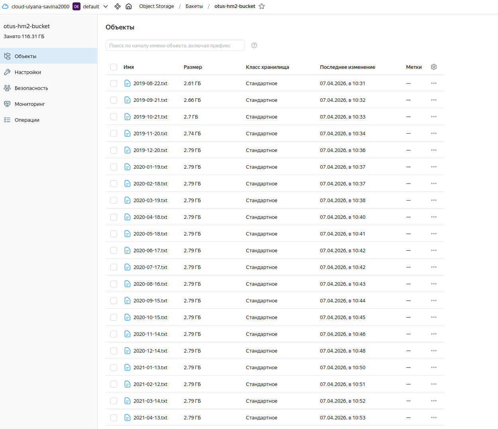
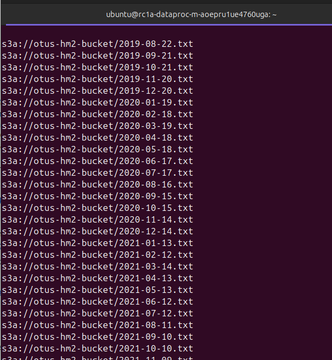

# 1. Создан новый bucket
- main_bucket.tf

# 2. Скопировано содержимое хранилища
- https://console.yandex.cloud/folders/b1gbn46dh3brmc00uia5/storage/buckets/otus-hm2-bucket?versionsDisplay=false

# 3. Создан Spark-кластер
-main_cluster.tf

# 4. Произведено соединение по SSH с мастер узлом

# 5. Кластер удален 

